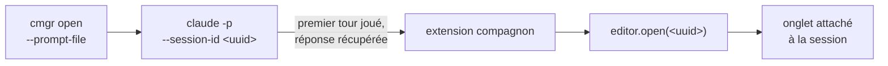

<div align="center">

# ClaudeManager

**Ouvrir, observer et fermer des conversations Claude dans VSCode — depuis un agent, sans jamais voler le focus.**

[](https://github.com/lucasPaulDaniele/ClaudeManager/actions/workflows/ci.yml)
[](LICENSE)


</div>

---

## Le problème

Un agent Claude ne peut pas ouvrir une conversation Claude.

Cela paraît anecdotique jusqu'à ce qu'on automatise un vrai workflow. Prenons un orchestrateur qui enchaîne des incréments de développement en autonomie, avec une règle simple : **une conversation = un lot de travail**. Quand le lot est terminé, il faut repartir sur un contexte neuf.

À cet instant précis, l'agent s'arrête et écrit :

> « Merci de fermer cette conversation et d'en ouvrir une nouvelle avec `/orchestrer mon-chantier`. »

L'humain fait deux clics et colle un prompt. Aucune valeur ajoutée, mais la boucle autonome est cassée — et elle le reste jusqu'à ce que quelqu'un soit devant l'écran.

**ClaudeManager supprime ce passe-plat.**

## Ce que ça fait

```bash
# Depuis une conversation Claude, dans sa propre fenêtre VSCode :
cmgr open --prompt-file ./amorce.md --wait
```

Une nouvelle conversation apparaît dans la fenêtre, son premier tour déjà joué, et la commande rend la main avec la réponse. La fenêtre peut être **minimisée, masquée, sur un autre bureau virtuel** : rien ne bouge à l'écran, rien ne prend le focus.

| Opération | État |
|---|---|
| Ouvrir une conversation avec un prompt d'amorçage | ✅ mécanisme validé |
| Fermer une conversation | ✅ mécanisme validé |
| Lire une réponse / attendre la fin d'un tour | ✅ mécanisme validé |
| Cibler la bonne fenêtre parmi plusieurs, même identiques | ✅ mécanisme validé |
| Écrire dans une conversation déjà ouverte | ❌ hors périmètre — [pourquoi](docs/adr/001-pilotage-des-conversations.md) |
| Arrêter un prompt en cours | ❌ hors périmètre — [pourquoi](docs/adr/001-pilotage-des-conversations.md) |

## Comment ça marche

L'extension Claude pour VSCode n'expose aucune API publique. Elle expose en revanche une commande interne, `claude-vscode.editor.open(sessionId, prompt)` — et le premier réflexe est de lui passer un prompt.

**C'est un piège** : ce paramètre se contente de *pré-remplir* le champ de saisie. Rien n'est envoyé. Il faudrait simuler une frappe clavier, donc donner le focus à la fenêtre, donc renoncer à piloter une fenêtre cachée.

ClaudeManager prend le problème à l'envers : **on amorce la session hors interface, puis on y attache l'UI.**



1. On génère un identifiant de session.
2. Le premier tour est joué **en headless**, dans le dossier de travail de la fenêtre cible. Sa réponse est retournée directement — pas besoin de lire quoi que ce soit ensuite.
3. Une **extension VSCode compagnon** attache un panneau à cette session existante.

Le résultat est une conversation normale, visible, reprenable à la main — dont le premier tour a été joué par un agent.

### Pourquoi une extension compagnon

Parce que c'est la seule voie. L'extension Claude n'exporte rien depuis `activate()`, et ses commandes ne sont appelables que **depuis l'intérieur de VSCode**. C'est aussi ce qui rend le pilotage indépendant du focus : `executeCommand` n'a jamais besoin qu'une fenêtre soit visible, là où toute automatisation clavier l'exige.

### Comment on ne se trompe pas de fenêtre

C'est l'invariant du produit. Une commande émise depuis une fenêtre ne doit **jamais** affecter une autre — y compris quand deux fenêtres ouvrent le même dossier.

L'ancrage n'est ni le titre de la fenêtre, ni le dossier, ni `VSCODE_PID` (un seul processus principal héberge toutes les fenêtres, cette variable ne discrimine rien). C'est la **chaîne d'ancêtres du processus** :

```
claude.exe  →  extension host  →  processus principal VSCode
   17816          11172                  16196
                    ↑
        unique par fenêtre : voilà la clé
```

Chaque instance de l'extension compagnon connaît son propre extension host et peut donc répondre avec certitude : « ce processus est-il un des miens ? »

## Installation

> **Statut** : le socle et la conception sont posés, les paquets ne sont pas encore publiés.
> Voir la [feuille de route](#feuille-de-route). Les commandes ci-dessous décrivent la cible.

```bash
npm install -g @claudemanager/cli
code --install-extension claudemanager-vscode
cmgr doctor
```

## Utilisation

### En ligne de commande

```bash
cmgr whoami                              # quelle fenêtre, quelle conversation
cmgr conversations                       # les conversations ouvertes ici
cmgr open --prompt-file ./amorce.md      # ouvrir, avec un prompt d'amorçage
cmgr open --prompt-file ./a.md --wait    # ... et attendre la réponse
cmgr close <id>                          # fermer une conversation
cmgr read <sessionId>                    # relire la dernière réponse
cmgr doctor                              # diagnostiquer l'environnement
```

Toutes les commandes écrivent du **JSON sur stdout** et les diagnostics sur stderr : le consommateur visé est un agent, pas un humain.

Le prompt passe **toujours par fichier**, jamais en argument — l'échappement des prompts longs en shell (a fortiori PowerShell) est une source de bugs inépuisable.

### Comme serveur MCP

C'est le mode recommandé pour un agent : les prompts multi-lignes deviennent un champ JSON, plus aucun échappement.

```json
{
  "mcpServers": {
    "claudemanager": { "command": "npx", "args": ["-y", "@claudemanager/mcp"] }
  }
}
```

Outils exposés : `claude_whoami`, `claude_list_conversations`, `claude_open_conversation`, `claude_close_conversation`, `claude_read_response`, `claude_wait_for_idle`.

## Limites et risques — à lire avant d'adopter

Ce projet repose sur des **API internes non documentées** de l'extension Claude Code. C'est un choix assumé, pas un angle mort : il n'existe aucune API publique pour ce besoin.

- **Une mise à jour de l'extension peut tout casser.** Chaque point d'adhérence est recensé dans [`docs/compatibilite.md`](docs/compatibilite.md) avec la version sur laquelle il a été vérifié. `cmgr doctor` vérifie les présupposés et **échoue explicitement** — jamais de dégradation silencieuse.
- **Le tour d'amorçage s'exécute hors interface.** Vous ne le voyez se dérouler qu'une fois la conversation attachée.
- **Le Workspace Trust désactive tout.** Dans une fenêtre en Restricted Mode, les commandes de l'extension Claude *n'existent pas*, sans le moindre message d'explication. `cmgr doctor` le détecte et le nomme.
- **Les tests bout-en-bout exigent l'extension Claude authentifiée** : ils sont donc impossibles en CI publique. La CI couvre lint, typecheck, tests unitaires et packaging ; les preuves d'exécution locale sont jointes aux PR.

## Architecture

```
packages/core      logique pure — identité, registre, sessions, transcripts
                   (n'importe jamais `vscode` : c'est ce qui la rend testable)
packages/vscode    extension compagnon — attache et ferme, rien de plus
packages/cli       binaire `cmgr`
packages/mcp       serveur MCP
```

Deux règles gouvernent ce découpage : **le cœur ne connaît pas VSCode**, et **aucune opération ne dépend du focus**. Elles sont détaillées, avec leurs justifications, dans [`CLAUDE.md`](CLAUDE.md).

## Feuille de route

| Lot | Contenu | État |
|---|---|---|
| **0** | Spike de faisabilité, conventions, CI | ✅ |
| **A** | Noyau observable : identité, sessions, transcripts, CLI de lecture | ⏳ |
| **B** | Pilotage : extension compagnon, ouverture, fermeture | ⏳ |
| **C** | Hook de fin de tour, serveur MCP, packaging, release | ⏳ |

## Contribuer

Les conventions du projet sont dans [`CLAUDE.md`](CLAUDE.md) — elles sont exigeantes et assumées : 100 % de couverture sur le cœur, aucun mock du système réel (les tests d'intégration tournent contre une vraie fenêtre VSCode), et tout correctif de bug embarque un test qui **échoue avant le correctif**.

Les décisions structurantes sont tracées dans [`docs/adr/`](docs/adr/). Commencez par [l'ADR-001](docs/adr/001-pilotage-des-conversations.md) : il raconte les sept itérations de spike qui ont mené au mécanisme retenu, y compris les fausses pistes.

## Licence

[MIT](LICENSE)
