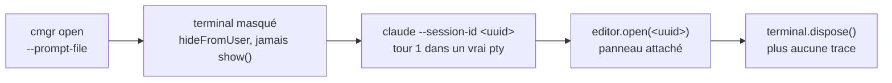

<div align="center">

# ClaudeManager

**Ouvrir, observer et fermer des conversations Claude dans VSCode — depuis un agent, sans jamais voler le focus.**

[](https://github.com/lucasPaulDaniele/ClaudeManager/actions/workflows/ci.yml)
[](LICENSE)


</div>

---

## Le problème

Un agent Claude ne peut pas ouvrir une conversation Claude.

Cela paraît anecdotique jusqu'à ce qu'on automatise un vrai workflow. Prenons un orchestrateur qui enchaîne des incréments de développement en autonomie, avec une règle simple : **une conversation = un lot de travail**. Quand le lot est terminé, il faut repartir sur un contexte neuf.

À cet instant précis, l'agent s'arrête et écrit :

> « Merci de fermer cette conversation et d'en ouvrir une nouvelle avec `/orchestrer mon-chantier`. »

L'humain fait deux clics et colle un prompt. Aucune valeur ajoutée, mais la boucle autonome est cassée — et elle le reste jusqu'à ce que quelqu'un soit devant l'écran.

**ClaudeManager supprime ce passe-plat.**

## Ce que ça fait

```bash
# Depuis une conversation Claude, dans sa propre fenêtre VSCode :
cmgr open --prompt-file ./amorce.md --wait
```

Une nouvelle conversation apparaît dans la fenêtre, son premier tour déjà joué. La fenêtre peut être **minimisée** : rien ne bouge à l'écran, rien ne prend le focus — c'est [mesuré](docs/adr/002-ouverture-interactive.md), pas espéré. *(L'état minimisé est le seul mesuré à ce jour. Masquée, sur un autre bureau virtuel ou derrière d'autres applications : ce sont des **exigences** du projet, pas encore des relevés.)* Avec `--wait`, la commande rend la main avec la réponse du premier tour, qu'elle relit dans le transcript de la session.

| Opération | État |
|---|---|
| Ouvrir une conversation avec un prompt d'amorçage | ✅ mécanisme **mesuré** — [voie V1](docs/adr/002-ouverture-interactive.md) |
| Fermer une conversation | ✅ **livré et mesuré** — `cmgr conversations` puis `cmgr close <id>`. La fermeture est un **contrat en deux temps** : lister, puis fermer l'onglet dont on peut **prouver** qu'il est celui qu'on a désigné |
| Cibler la bonne fenêtre parmi plusieurs, même identiques | ✅ mécanisme **mesuré** en configuration adverse — [deux fenêtres, même répertoire physique, même `Code.exe` principal](docs/adr/002-ouverture-interactive.md) |
| Lire une réponse / attendre la fin d'un tour | 🚧 **conçu, pas encore mesuré** — c'est la condition d'obtention de la réponse du tour 1, et elle relève du lot D |
| Écrire dans une conversation déjà ouverte | ❌ hors périmètre — [pourquoi](docs/adr/002-ouverture-interactive.md) |
| Arrêter un prompt en cours | ❌ hors périmètre — **décision**, pas impossibilité mesurée : aucune primitive propre identifiée, et aucun spike ne l'a exploré |

« Mesuré » qualifie le **mécanisme**, pas la livraison : aucun paquet n'est encore publié. Voir la [feuille de route](#feuille-de-route).

## Comment ça marche

L'extension Claude pour VSCode n'expose aucune API publique. Elle expose en revanche une commande interne, `claude-vscode.editor.open(sessionId, prompt)` — et le premier réflexe est de lui passer un prompt.

**C'est un piège**, et il est prouvé deux fois : la lecture du bundle montre que ce paramètre se contente d'appeler `setInputText`, et la mesure le confirme — le prompt s'assoit dans le champ de saisie, la flèche d'envoi attend. Rien n'est envoyé. Il faudrait simuler une frappe clavier ; or les frappes synthétiques **n'atteignent même pas le champ du webview**, avec ou sans focus ([mesuré](docs/adr/002-ouverture-interactive.md)).

ClaudeManager prend donc le problème autrement : **on joue le premier tour dans un vrai terminal, jamais affiché, puis on attache le panneau à la session ainsi créée.**



1. On génère un identifiant de session.
2. L'**extension compagnon** crée dans la fenêtre cible un terminal **masqué** — `hideFromUser: true`, `show()` jamais appelé — en **neutralisant les variables d'environnement héritées** de la session Claude appelante. Sans cette précaution, le `claude` lancé là se croit agent enfant, se déclare non interactif et cesse d'écrire son transcript. Silencieusement.
3. Le premier tour y est joué par un vrai `claude --session-id <uuid> "<prompt>"` : une session **réellement interactive**, dans un pty.
4. `claude-vscode.editor.open(<uuid>)` attache un panneau à cette session, puis `terminal.dispose()` fait disparaître le terminal.

Le résultat est une conversation normale, visible, reprenable à la main — dont le premier tour a été joué par un agent. Durée de visibilité du terminal pour l'humain : **nulle**.

### Si l'extension change — le repli

`editor.open` et `--session-id` ne sont contractuels ni l'un ni l'autre. Le projet a donc un **repli officiel, lui aussi mesuré** : `editor.open(null, <prompt>)` ouvre la conversation avec le prompt **pré-rempli**, et l'humain valide d'un geste. On perd l'autonomie complète ; on garde l'essentiel — il n'a ni à créer la conversation, ni à retrouver la fenêtre, ni à recopier le prompt. Mieux vaut un geste humain qu'une conversation non ouverte. Détail dans [l'ADR-002](docs/adr/002-ouverture-interactive.md).

### Pourquoi une extension compagnon

Parce que c'est la seule voie. L'extension Claude n'exporte rien depuis `activate()`. Un appel venu de l'extérieur n'est pas strictement impossible — elle enregistre un gestionnaire d'URI, `vscode://anthropic.claude-code/open?session=&prompt=` — mais ses deux paramètres sont une session et un prompt : **rien qui désigne une fenêtre**, et il retombe sur le même `primaryEditor.open` (lu au source, [ADR-002](docs/adr/002-ouverture-interactive.md)). Or c'est exactement ce dont on a besoin : **désigner la fenêtre** qui exécute l'ouverture, et y **créer un terminal**. Ces deux gestes exigent de tourner *dans* la fenêtre. C'est aussi ce qui rend le pilotage indépendant du focus : `executeCommand` et `createTerminal` n'ont jamais besoin qu'une fenêtre soit visible, là où toute automatisation clavier l'exige.

### Comment on ne se trompe pas de fenêtre

C'est l'invariant du produit. Une commande émise depuis une fenêtre ne doit **jamais** affecter une autre — y compris quand deux fenêtres ouvrent le même dossier.

L'ancrage n'est ni le titre de la fenêtre, ni le dossier, ni `VSCODE_PID` (un seul processus principal héberge toutes les fenêtres, cette variable ne discrimine rien). C'est la **chaîne d'ancêtres du processus** :

```
claude.exe  →  pwsh.exe  →  claude.exe  →  extension host  →  Code.exe principal
   18408         16016         22352            11172               16196
                                                  ↑
                                  unique par fenêtre : voilà la clé
```

Relevé sur une machine réelle et versionné dans le dépôt (`tests/fixtures/identity/`). **La profondeur n'est pas contractuelle** : ici trois sauts séparent le processus appelant de son extension host, et rien ne garantit ce nombre — il dépend de la façon dont la session a été lancée. On remonte donc **toute la chaîne**, jamais le seul parent, et l'on retient la fenêtre la plus proche de l'appelant.

Chaque instance de l'extension compagnon connaît son propre extension host et peut donc répondre avec certitude : « ce processus est-il un des miens ? »

Ce n'est pas une intuition d'architecture : c'est mesuré en configuration adverse — deux fenêtres pointant sur le **même répertoire physique** et partageant le **même `Code.exe` principal**. Les opérations adressées à l'une n'ont créé dans l'autre ni onglet, ni terminal, ni processus. Relevés dans [l'ADR-002](docs/adr/002-ouverture-interactive.md).

Une réserve, portée par le montage : VSCode refusant d'ouvrir un même dossier dans deux fenêtres, le cas se construit par **jonction de répertoire** — les deux fenêtres ont donc bien le même répertoire physique, mais des **chemins de workspace distincts**. Cet angle mort est nommé dans [`docs/compatibilite.md`](docs/compatibilite.md) ; l'E2E multi-fenêtres doit le couvrir par un test dédié — il exige l'extension **installée**, et relève donc du lot E.

## Installation

> **Statut** : rien n'est publié — ni sur npm, ni sur le Marketplace. On installe donc **depuis
> les artefacts construits localement**, et c'est délibéré : voir la
> [feuille de route](#feuille-de-route).

**Prérequis** : Node ≥ 20, le lanceur `code` sur le `PATH` (`code --version` doit répondre), et
**PowerShell 7 (`pwsh`) sur le `PATH`** (`pwsh --version` doit répondre).

> **`pwsh` est un prérequis dur, pas un confort — et Windows ne le fournit pas.** Le système
> livre `powershell.exe` 5.1 ; PowerShell 7 s'installe séparément. Le tour 1 est joué dans un
> shell, jamais en lançant `claude.exe` directement : c'est le shell qui garde un canal ouvert
> vers le processus, donc qui rend franchissables les deux portes du CLI. Aucun repli silencieux
> sur un autre shell n'est fait — leurs règles de citation diffèrent, et la forme envoyée au pty
> n'a été mesurée que sous PowerShell. Sans lui, `cmgr open` refuse en nommant
> `SEED_SHELL_NOT_FOUND` ; `cmgr windows` et `cmgr whoami`, eux, n'en ont pas besoin.

### 1. Construire les deux paquets

```bash
git clone https://github.com/lucasPaulDaniele/ClaudeManager.git
cd ClaudeManager
npm ci
npm run package:all
```

`artifacts/` contient alors exactement deux fichiers :

```
artifacts/claudemanager-vscode-0.6.0.vsix    # l'extension compagnon
artifacts/claudemanager-cli-0.5.0.tgz        # le binaire cmgr
```

Pour contrôler que ces archives portent bien ce qu'il faut — les **deux** racines compilées,
et rien d'autre — avant de rien installer :

```bash
npm run verify:packaging
```

### 2. Installer l'extension compagnon

```bash
code --install-extension artifacts/claudemanager-vscode-0.6.0.vsix
code --list-extensions --show-versions | grep claudemanager
```

La seconde commande doit afficher `claudemanager.claudemanager-vscode@0.6.0`.

> **⚠️ Une fenêtre DÉJÀ OUVERTE ne prend pas cette installation — ni une première, ni une mise à
> jour. Il faut une fenêtre NEUVE.** Le seul `activationEvents` de l'extension est
> `onStartupFinished` : elle s'active au **démarrage d'une fenêtre**, et rien d'autre ne la
> réveille.
>
> **Mesuré le 2026-07-26**, en installant la 0.4.0 sur un poste où trois fenêtres étaient
> ouvertes, 40 s d'observation : **aucune n'a republié**. Y compris — et c'est le cas le plus
> parlant — celle qui exécutait déjà l'extension en **0.3.0** : son entrée de registre annonçait
> toujours `0.3.0` après l'installation. Une **mise à jour ne se réactive pas davantage** qu'une
> première installation. Seule une fenêtre ouverte **après** l'installation a publié en 0.4.0.
>
> **Le geste, donc** : ouvrez une **nouvelle** fenêtre VSCode (`Fichier ▸ Nouvelle fenêtre`, puis
> ouvrez-y votre dossier) — ou fermez et rouvrez celles dont vous avez besoin, **au moment de
> votre choix**.
>
> **NE RECHARGEZ PAS une fenêtre qui héberge une conversation en cours** : `Developer: Reload
> Window` redémarre l'extension host, et **tue avec lui les `claude.exe` qui en descendent**.
> C'est vous qui choisissez quand renouveler une fenêtre, jamais l'outil.

**Conséquence, tant qu'une fenêtre n'a pas été renouvelée** : elle sert **l'ancienne version** de
l'extension à une CLI déjà à jour. Ce décalage n'est **jamais silencieux**, dans les deux sens —
mais les deux sens ne se valent pas, et le second demande d'avoir lu ce qui suit **avant** de le
rencontrer.

**Fenêtre en retard, CLI à jour** — le cas bénin. `cmgr open` dit que le tour 1 **n'est pas
vérifié** et sort en **code 4**, jamais en `0`, en vous renvoyant à `cmgr windows` pour comparer
les versions. Les routes que l'ancienne extension ne connaît pas, elle les refuse en `404` →
`WINDOW_REQUEST_REFUSED`, dont la remédiation nomme la cause.

**CLI en retard, fenêtre à jour** — le cas qui peut vous coûter une conversation. Une CLI 0.2.0
**refuse** la réponse d'une fenêtre à jour par **`WINDOW_RESPONSE_UNREADABLE`**, avec
`missing: "firstTurnVerified"` — vérifié le 2026-07-27 en rejouant ce client d'époque sur une
réponse réelle de fenêtre à jour. Et ce refus est **postérieur à l'ouverture** : la conversation
**est ouverte** et le tour 1 **joué**, pendant que la CLI sort en erreur.

> **Le piège tient à ce qu'une vieille CLI ne peut pas savoir.** Le code qui distingue ce cas —
> `WINDOW_OPEN_RESPONSE_UNREADABLE`, dont la remédiation dit « la validation est postérieure à
> l'effet de bord, ne relancez pas à l'aveugle » — **n'existe pas** dans les CLI 0.2.0 et 0.3.0 :
> il n'a été introduit qu'après elles. Une CLI d'époque range donc ce refus avec ceux des **routes
> de lecture**, et vous rend la remédiation qui va avec — laquelle dit de **recharger la fenêtre**
> après mise à jour. **C'est le geste interdit ci-dessus**, et il tuerait la conversation qui vient
> précisément de s'ouvrir.
>
> **Le geste, si vous y êtes** : ne rechargez rien, et ne relancez pas `cmgr open` à l'aveugle — ce
> serait ouvrir une **seconde** conversation par-dessus la première. Regardez la fenêtre :
> l'onglet est là. Mettez les **deux** artefacts à jour, puis ouvrez une fenêtre **neuve**.

**Installez donc les deux artefacts ensemble**, puis renouvelez les fenêtres.

> **Un numéro de version ne discrimine pas toujours un protocole, et c'est vrai du passé de ce
> dépôt.** Pendant le lot C, le protocole a changé **sans** que le numéro monte : l'extension
> **0.2.0** désigne à la fois la surface du lot B — qui n'a **aucune** route `/conversations` — et
> celle des incréments C1 et C2, qui la porte ; la CLI **0.3.0** désigne deux états séparés par la
> correction du gate de mi-lot. Comparer les deux numéros peut donc rendre un verdict **faux** sur
> ces versions-là. **La règle qui vaut désormais** : toute évolution observable du protocole monte
> le numéro, dans l'incrément qui la produit — c'est ce que le lot C a fait à partir de là
> (extension **0.6.0**, CLI **0.5.0**). L'historique, lui, ne se réécrit pas.

Constater l'activation, sans rien solliciter :

```bash
ls ~/.claudemanager/windows/
cmgr windows     # la version que chaque fenêtre SERT réellement, `extensionVersion`
```

Un fichier `<extHostPid>.json` par fenêtre pilotable. **La version qui compte est celle que
l'entrée annonce**, pas celle que `code --list-extensions` affiche : la seconde dit ce qui est
installé sur le disque, la première ce que chaque fenêtre exécute. Aucun fichier, ou une version
en retard = aucune fenêtre neuve depuis l'installation : ouvrez-en une.

#### Si un répertoire `…-0.1.0` traîne encore

Un travail hors-process a pu laisser sur le poste un
`~/.vscode/extensions/claudemanager.claudemanager-vscode-0.1.0/`. Il porte **le même
identifiant d'extension** que ce qui s'installe ici, mais il est **absent d'`extensions.json`** :
VSCode l'ignore, il n'est ni chargé ni listé par `code --list-extensions`.

`code --uninstall-extension` ne le retire pas — il n'est pas enregistré. Vérifiez d'abord que
la version installée est bien celle attendue, puis supprimez le vestige à la main :

```bash
code --list-extensions --show-versions | grep claudemanager   # doit dire @0.6.0
rm -rf ~/.vscode/extensions/claudemanager.claudemanager-vscode-0.1.0
```

C'est aussi la raison pour laquelle **aucun VSIX n'est livré en 0.1.0** : la version est le seul
discriminant dans le nom de ce répertoire.

### 3. Installer la CLI

```bash
npm install -g ./artifacts/claudemanager-cli-0.5.0.tgz
cmgr --version     # {"command":"version","ok":true,"name":"cmgr","version":"0.5.0"}
cmgr windows       # les fenêtres pilotables, jeton masqué
```

Le tarball embarque **`dist/cli` et `dist/core`** : le paquet ne déclare aucune dépendance, tout
ce qu'il exécute est dedans.

### Ce que l'outil ne fait pas encore

À lire **avant** la première utilisation, sous peine de prendre une limite connue pour un bug :

| | |
|---|---|
| **Précondition — le CLI `claude` doit avoir été autorisé, ET le dossier approuvé** | `cmgr open` joue le tour 1 dans un terminal masqué. Le CLI interactif franchit deux portes avant d'écrire quoi que ce soit : l'**autorisation OAuth**, que seul le propriétaire du compte peut accorder, et la **confiance du dossier** (`Quick safety check…`), posée **par répertoire** et **jamais héritée d'un dossier voisin**. **Mesuré le 2026-07-26** sur une machine dont l'OAuth était accordé : dans un dossier **neuf**, le CLI reste dans son écran d'accueil et n'écrit **aucun** transcript — observé 180 s durant ; dans un dossier déjà approuvé, le même prompt écrit son transcript en **2,5 s**. `cmgr open` ne se laisse plus abuser : il **refuse en nommant** `SEED_TRANSCRIPT_NOT_FOUND` au lieu d'ouvrir un panneau vide. Remède : lancer `claude` **une fois à la main dans ce dossier**, accorder l'autorisation et approuver le dossier. |
| **Fermer une conversation TUE son processus** | **Mesuré le 2026-07-27** : le `claude.exe` de la conversation meurt avec son onglet. Ce n'est pas une perte de données — le **transcript survit intact**, et une réouverture sur le même `sessionId` retrouve la conversation *et son historique*. Mais c'est un **ordre d'opérations** : pour renouveler une conversation, **ouvrir la neuve d'abord, fermer l'ancienne ensuite**. Une conversation qui fermerait son propre onglet tuerait le processus même qui attend la réponse de `cmgr close`. |
| **Une poignée de conversation périme — vite** | `cmgr close` exige un `cmgr conversations` **préalable**, dans la même session de fenêtre, **et sans que rien ne change entre les deux** : une poignée désigne une **place dans un arrangement**, et toute conversation qui s'ouvre, se ferme ou se déplace les périme **toutes**. Une poignée déjà employée pour fermer ne ferme jamais deux fois. Aucun onglet Claude ne porte d'identifiant stable, et la fermeture refuse plutôt que de fermer au plus probable : le refus est nommé (`CONVERSATION_HANDLE_STALE`) et **rien n'est fermé** — relister, puis vérifier que la conversation visée est bien encore là avant de retenter. |
| **Pas de lecture de réponse** | Le tour 1 est **vérifié** — `firstTurnVerified: true` atteste que le transcript de la session **existe** —, mais son **contenu** n'est pas lu : la réponse elle-même n'est pas restituée. Il faudra le transcript ou le hook `Stop` (lot D, `cmgr open --wait`). |
| **Pas de `cmgr doctor`** | Le diagnostic des présupposés ci-dessus relève du lot D. En attendant, ils se vérifient à la main.  |

### Désinstaller

```bash
npm uninstall -g @claudemanager/cli
code --uninstall-extension claudemanager.claudemanager-vscode
rm -rf ~/.claudemanager
```

**Il reste un répertoire, et il peut porter un prompt en clair.** L'extension écrit le fichier
transitoire du prompt dans son `globalStorage`, hors de `~/.claudemanager` — que la commande
ci-dessus n'atteint donc pas. Ce fichier est effacé par la ligne du shell elle-même, l'extension
a un filet, et un balayage reprend les résidus à chaque ouverture comme à chaque activation ;
mais une extension désinstallée ne balaie plus rien. Supprimer aussi :

```bash
# Windows
rm -rf "$APPDATA/Code/User/globalStorage/claudemanager.claudemanager-vscode"
# macOS
rm -rf ~/Library/Application\ Support/Code/User/globalStorage/claudemanager.claudemanager-vscode
# Linux
rm -rf ~/.config/Code/User/globalStorage/claudemanager.claudemanager-vscode
```

Un prompt d'orchestration porte tout le contexte d'un lot : ce n'est pas un fichier temporaire
comme un autre.

## Utilisation

### En ligne de commande

**Livré et exécutable aujourd'hui.** `cmgr windows` et `cmgr whoami` ne font **aucun réseau** ;
`cmgr conversations` en fait, sans aucun effet de bord — les onglets d'une fenêtre ne se lisent que
*dans* cette fenêtre ; `cmgr open` et `cmgr close`, eux, **agissent** — ils demandent à la fenêtre
hôte, sur `127.0.0.1`, d'ouvrir ou de fermer une conversation. Aucune commande n'écrit dans le
registre ni ne le purge.

```bash
cmgr windows      # ✅ énumère les fenêtres pilotables, jeton masqué, et restitue tout ce
                  #    qui a été écarté du registre avec son motif
cmgr whoami       # ✅ résout la fenêtre hôte du processus appelant, par sa chaîne d'ancêtres
cmgr conversations
                  # ✅ énumère les conversations ouvertes DANS la fenêtre hôte, chacune avec une
                  #    **poignée** (`id`), son libellé, sa position. Lecture pure : aucun onglet
                  #    n'est touché. Une liste vide n'est pas une erreur — code 0.
cmgr open --prompt-file ./amorce.md
                  # ✅ ouvre une conversation dans la fenêtre hôte, avec un prompt d'amorçage.
                  #    Le canal est **confirmé** par `GET /health` — identité discordante,
                  #    aucune ouverture. La sortie porte `firstTurnVerified: true` quand le
                  #    **transcript de la session existe** — le tour a eu lieu ; la RÉPONSE,
                  #    elle, reste à lire (lot D). Pas de transcript = refus nommé.
cmgr close <id>   # ✅ ferme UNE conversation — celle que la poignée désigne, et aucune autre.
                  #    Le succès n'est rendu qu'après avoir **constaté** que l'onglet a quitté
                  #    `tabGroups`. Le focus n'est jamais emprunté.
cmgr --help       # ✅ (-h) la description complète, en JSON
cmgr --version    # ✅ (-v) le nom et la version du binaire, en JSON
```

**Fermer se fait en deux temps, et ce n'est pas une commodité.** L'API `vscode.Tab` **ne porte
aucun identifiant**, et aucun de ses champs n'est stable : le `viewType` est le même pour tous les
panneaux Claude, le libellé est dérivé du **contenu** de la conversation et change en cours de
route ([mesuré](docs/compatibilite.md), D24), la position bouge au premier déplacement. La fenêtre
**synthétise** donc une poignée opaque au moment de lister, retient ce qu'elle a relevé, et
**refuse** de fermer si l'onglet désigné ne correspond plus.

```bash
cmgr conversations                    # 1. lister — la sortie porte les poignées
cmgr close 8d1f4f0e-6d2f-4a63-…       # 2. fermer celle qu'on a choisie, sans rien changer entre
```

**Une poignée désigne une place dans un arrangement, pas un onglet — et c'est la correction du
gate final du lot C.** Les quatre champs d'un onglet ne le distinguent pas : deux panneaux Claude
fraîchement attachés ne diffèrent que par leur **rang**, et fermer le premier fait **glisser** le
second sur le rang libéré. Le voisin devenait alors, champ pour champ, la poignée du disparu — et
le produit fermait *sa* conversation en annonçant un succès. Deux règles ferment ce chemin :

- **le relevé d'ensemble** — la poignée retient le placement de **toutes** les conversations, et la
  fermeture exige qu'il n'ait pas bougé. Toute conversation qui **s'ouvre, se ferme ou se déplace**
  périme donc **toutes** les poignées de la fenêtre ;
- **une poignée ne ferme qu'une fois** — dès que l'éditeur a été sollicité avec elle, elle est
  dépensée, que la fermeture ait abouti ou non.

Conséquence pratique, et elle vaut d'être lue avant d'écrire un script : **fermer aussitôt après
avoir listé**, et, pour renouveler une conversation, **ouvrir la neuve → lister → fermer
l'ancienne**. Lister avant d'ouvrir rend une poignée que l'ouverture périme aussitôt.

Le prix est un refus (`CONVERSATION_HANDLE_STALE`) chaque fois que quelque chose a bougé entre les
deux temps ; le gain est qu'**aucun onglet n'est jamais fermé sans preuve**, et que **relancer une
fermeture ne peut plus rien fermer**. Après un refus : relister, et **vérifier que la conversation
visée y figure encore** — si elle n'y est plus, elle est déjà fermée, et il ne faut surtout pas
fermer celle qui a pris sa place.

**Cible, pas encore livré** — chaque ligne renvoie au lot qui la porte :

```bash
cmgr read <sessionId>                    # 🚧 lot D — relire la dernière réponse
cmgr open --prompt-file ./a.md --wait    # 🚧 lot D — ouvrir, puis attendre la réponse
cmgr doctor                              # 🚧 lot D — diagnostiquer l'environnement
```

**Codes de sortie** — un agent décide sans analyser la sortie : `0` succès, `1` erreur nommée du
domaine, `2` erreur d'usage, `3` défaillance imprévue de ClaudeManager, et `4` **succès dégradé** —
une conversation **existe**, mais le tour 1 n'est pas acquis. Ni `0` (le tour ne tourne pas) ni `1`
(l'opération a bien eu lieu ; la retenter ouvrirait une seconde conversation).

**Deux cas portent le `4`**, et ils disent la même chose : *ne retente pas à l'aveugle.*

| Cas | Ce que la sortie porte | Le geste |
|---|---|---|
| **Repli V5** | `mode: "fallback"`, `humanActionRequired: true`, `degradedFrom` | Le prompt est **pré-rempli** dans le champ de saisie : le valider. |
| **Tour 1 non vérifié** | `mode: "seeded"`, `firstTurnVerified: false` | La fenêtre porte une version de l'extension qui n'observait que le démarrage d'un processus — **c'est la combinaison mesurée comme pouvant rendre un panneau vide**. Comparer son `extensionVersion` avec `cmgr windows`, puis **renouveler la fenêtre**. |

Un seul code pour les deux : ces codes encodent une **décision**, et la décision est la même. Ce
qui diffère est un renseignement, et il est dans la sortie JSON comme sur `stderr`.

Toutes les commandes écrivent du **JSON sur stdout** et les diagnostics sur stderr : le consommateur visé est un agent, pas un humain. Cela vaut **sans exception**, y compris pour `--help` et pour les erreurs — un agent doit pouvoir faire `JSON.parse(stdout)` sans condition.

Le prompt passe **toujours par fichier** — ou, à défaut, par `stdin` — et **jamais en argument** : `cmgr open "mon prompt"` est une erreur d'usage. L'échappement des prompts longs en shell (a fortiori PowerShell) est une source de bugs inépuisable. Cette règle porte sur **l'interface de `cmgr` vis-à-vis de son appelant**, et seulement sur elle.

Quand `--prompt-file` est donné, `stdin` n'est **ni lu ni inspecté** : le fichier prime, et `prompt.source` dans la sortie dit toujours d'où le prompt est venu. Ce n'est pas une préférence — c'est [mesuré](CLAUDE.md) : ni `isTTY` ni `fstat(0)` ne distinguent « un prompt attend sur `stdin` » de « `stdin` est branché sur rien », si bien que détecter un conflit transformerait l'invocation nominale d'un agent en erreur. Un conflit qu'on rend **impossible** vaut mieux qu'un conflit qu'on croit détecter.

Le **transport interne** vers le pty, lui, a été **tranché par la mesure** le 2026-07-26 ([ADR-004](docs/adr/004-transport-du-prompt.md)) : le prompt reste **positionnel** — le CLI n'offre rien d'autre —, et il est alimenté depuis un **fichier transitoire que le shell lit en donnée**, si bien qu'il ne traverse jamais l'analyseur du shell. Le plafond, lui, est réel et **il est celui de `CreateProcess`, pas du terminal** : mesuré, 32 000 caractères passent et 32 600 échouent — **sans la moindre erreur**. C'est cet échec silencieux qui est inacceptable, pas le plafond : une garde du cœur pèse la ligne **avant** de l'envoyer et refuse par une erreur nommée, puis bascule sur le repli pré-rempli — lequel passe le prompt en mémoire, hors de toute ligne de commande.

`--wait` relit la réponse du premier tour dans le transcript de la session : il dépend du lot D (voir la [feuille de route](#feuille-de-route)).

### Comme serveur MCP

C'est le mode recommandé pour un agent : les prompts multi-lignes deviennent un champ JSON, plus aucun échappement.

```json
{
  "mcpServers": {
    "claudemanager": { "command": "npx", "args": ["-y", "@claudemanager/mcp"] }
  }
}
```

Outils exposés : `claude_whoami`, `claude_list_conversations`, `claude_open_conversation`, `claude_close_conversation`, `claude_read_response`, `claude_wait_for_idle`.

## Limites et risques — à lire avant d'adopter

Ce projet repose sur des **API internes non documentées** de l'extension Claude Code. C'est un choix assumé, pas un angle mort : il n'existe aucune API publique pour ce besoin.

- **Une mise à jour de l'extension peut tout casser.** Chaque point d'adhérence est recensé dans [`docs/compatibilite.md`](docs/compatibilite.md), avec la trace de sa vérification — ou un `— non vérifié` explicite quand aucune mesure ne l'étaie encore. Quand un présupposé tombe, l'outil **échoue explicitement** — jamais de dégradation silencieuse — et sa remédiation nomme le geste manuel qui le rétablit. Le diagnostic *automatique* de ces présupposés viendra avec `cmgr doctor` : **lot D, pas encore livré**.
- **Le tour d'amorçage se joue dans un terminal invisible.** La session est **réellement interactive** — c'est mesuré, pas déduit — mais le terminal n'est jamais affiché : vous ne voyez le premier tour qu'une fois le panneau attaché.
- **La réponse du premier tour n'est pas rendue directement.** La sortie du terminal n'étant pas capturée par l'appelant, cette réponse se lit dans le transcript de la session ou via le hook `Stop` : c'est ce que fait `--wait`, et cela dépend du lot D.
- **Le Workspace Trust désactive tout.** Dans une fenêtre en Restricted Mode, les commandes de l'extension Claude *n'existent pas*, sans le moindre message d'explication. `cmgr open` le détecte et le nomme (`WORKSPACE_NOT_TRUSTED`), avant toute autre tentative.
- **Deux portes peuvent bloquer le premier tour**, une fois par machine et par dossier : l'onboarding du CLI interactif (sélecteur de thème au premier lancement, qu'aucune variable d'environnement ne court-circuite) puis la confiance du dossier (`Quick safety check…`). Les deux se franchissent sans focus, mais leur libellé n'est pas contractuel : ClaudeManager ne les franchit **jamais** à l'aveugle — il refuse en nommant (`SEED_TRANSCRIPT_NOT_FOUND`, `SEED_PROCESS_NOT_STARTED`) et renvoie au geste qui marche : lancer `claude` **une fois à la main dans ce dossier**. Les *vérifier* et les nommer d'avance relèvera de `cmgr doctor` : **lot D, pas encore livré**.
- **L'extension compagnon écrit dans votre répertoire personnel et ouvre une écoute locale.** Chaque fenêtre publie un fichier `~/.claudemanager/windows/<pid>.json` décrivant ce qu'elle est, et ouvre un serveur HTTP sur `127.0.0.1`, port éphémère, protégé par un **jeton porteur** que ce fichier porte en clair. Le cœur pose `0700` sur le répertoire et `0600` sur l'entrée — **ce qui protège sur un poste POSIX multi-utilisateurs, et ne protège rien sous Windows** : `chmod` n'y pilote que l'attribut « lecture seule », et un relevé y rend `666` sur les deux. Sous Windows — la **cible première** — c'est l'**ACL héritée de votre répertoire personnel** qui protège, et elle le fait : relevé à `icacls` le 2026-07-27, `SYSTEM`, `Administrators` et votre compte, personne d'autre. Vérifier la protection du jeton sur ce système se fait donc à `icacls`, jamais sur des bits POSIX qui n'y veulent rien dire. Le jeton n'est jamais journalisé ni rendu par `/health`, et il ne survit pas à un rechargement de fenêtre. Rien n'est joignable depuis le réseau. Le détail, et les raisons de chaque choix, sont dans [l'ADR-003](docs/adr/003-registre-et-serveur-local.md).
- **Les tests bout-en-bout exigent l'extension Claude authentifiée** : ils sont donc impossibles en CI publique. La CI couvre lint, typecheck et tests unitaires avec seuils de couverture. Les tests d'intégration — une **vraie fenêtre VSCode**, via `@vscode/test-electron` — existent et tournent, mais **localement** : la CI publique devrait télécharger un éditeur complet et disposer d'un affichage. Leurs logs sont joints en preuve aux PR. Le **packaging** est outillé depuis l'incrément **C3** (`npm run package:all`), et sa vérification — le contenu réel des deux archives, `cmgr --version` lancé depuis le tarball — est **locale** au même titre, pour la même raison : elle exige des artefacts bâtis (`npm run verify:packaging`). La **publication** sur npm et sur le Marketplace, elle, n'est pas outillée : elle relève du lot **E**.

## Architecture

```
packages/core      logique pure — identité, registre, sessions, transcripts
                   (n'importe jamais `vscode` : c'est ce qui la rend testable)
packages/vscode    extension compagnon — attache, énumère et ferme, rien de plus
packages/cli       binaire `cmgr` — `windows`, `whoami`, `conversations`, `open`, `close`
packages/mcp       serveur MCP                             (lot E, pas encore livré)
```

Deux règles gouvernent ce découpage : **le cœur ne connaît pas VSCode**, et **aucune opération ne dépend du focus**. Elles sont détaillées, avec leurs justifications, dans [`CLAUDE.md`](CLAUDE.md).

## Feuille de route

| Lot | Contenu | État |
|---|---|---|
| **0** | Socle : spike de faisabilité, conventions, CI | ✅ |
| **A** | Trancher le mécanisme d'ouverture interactive ([ADR-002](docs/adr/002-ouverture-interactive.md)) | ✅ |
| **B** | Noyau : identité, registre, extension compagnon, CLI de lecture | ⏳ |
| **C** | Ouverture, **installabilité**, fermeture : mécanisme V1, `cmgr open`, empaquetage VSIX, `cmgr conversations` et `cmgr close` | ⏳ |
| **D** | Observabilité : transcript, hook `Stop`, `cmgr read` / `wait` / `doctor` | ⏳ |
| **E** | Diffusion : serveur MCP, **E2E multi-fenêtres**, release | ⏳ |
| **F** | Audits finaux | ⏳ |

*L'empaquetage est remonté du lot E au lot C le 2026-07-26 : tant que l'extension n'est pas installable, aucun incrément n'est livrable.*

## Contribuer

Les conventions du projet sont dans [`CLAUDE.md`](CLAUDE.md) — elles sont exigeantes et assumées : 100 % de couverture sur le cœur, aucun mock du système réel (les tests d'intégration tournent contre une vraie fenêtre VSCode), et tout correctif de bug embarque un test qui **échoue avant le correctif**.

Les décisions structurantes sont tracées dans [`docs/adr/`](docs/adr/). Commencez par [l'ADR-002](docs/adr/002-ouverture-interactive.md) : il compare cinq voies d'ouverture toutes mesurées sur pièce, et justifie celle qui est retenue. Puis, si les fausses pistes vous intéressent — elles sont instructives, et il y en a maintenant deux couches — [l'ADR-001](docs/adr/001-pilotage-des-conversations.md), remplacé, raconte les sept itérations de spike qui avaient mené au mécanisme précédent, et pourquoi il a fini par être rejeté en recette.

## Licence

[MIT](LICENSE)
